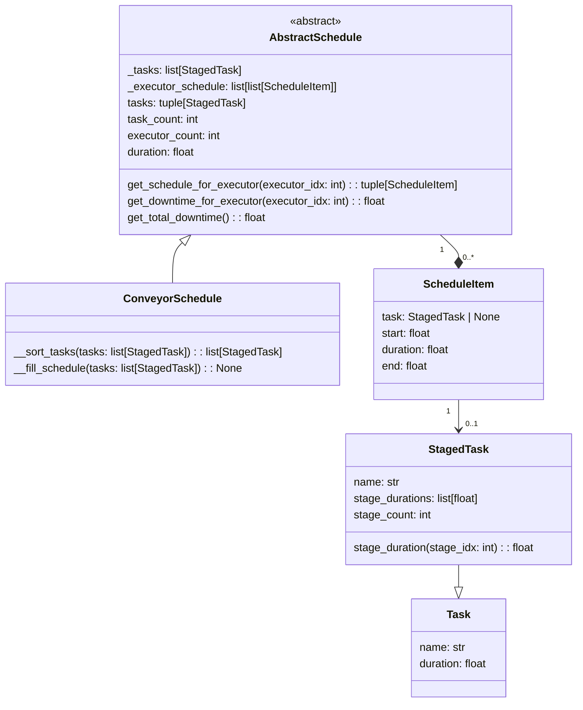

```mermaid
classDiagram
    AbstractSchedule <|-- ConveyorSchedule
    AbstractSchedule "1" --* "0..*" ScheduleItem
    ScheduleItem "1" --> "0..1" StagedTask
    StagedTask --|> Task

    class AbstractSchedule {
        <<abstract>>
        _tasks: list[StagedTask]
        _executor_schedule: list[list[ScheduleItem]]
        tasks: tuple[StagedTask]
        task_count: int
        executor_count: int
        duration: float
        get_schedule_for_executor(executor_idx: int): tuple[ScheduleItem]
        get_downtime_for_executor(executor_idx: int): float
        get_total_downtime(): float
    }

    class ConveyorSchedule {
        __sort_tasks(tasks: list[StagedTask]): list[StagedTask]
        __fill_schedule(tasks: list[StagedTask]): None
    }

    class Task {
        name: str
        duration: float
    }

    class StagedTask {
        name: str
        stage_durations: list[float]
        stage_count: int
        stage_duration(stage_idx: int): float
    }

    class ScheduleItem {
        task: StagedTask | None
        start: float
        duration: float
        end: float
    }
```